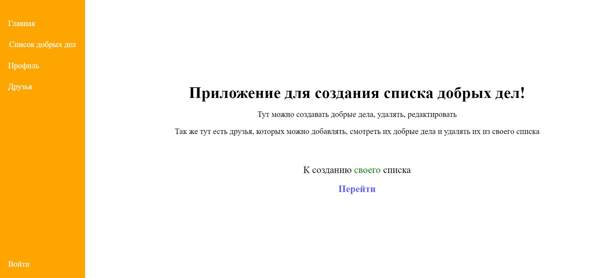

# good-deed

## Frontend: TS, React, NextJS, Redux, RTK query

## Backend: TS, NestJs, MongoDB

### Для запуска в Docker:

- `docker --version`
  Если Docker установлен, в консоли появится версия Docker.

- Проверить, что Docker Compose установлен, введя команду:
  `docker-compose --version`

- Теперь можно запустить frontend и backend командой:
  `docker-compose up`

После запуска контейнеров можно открыть браузер по адресу http://localhost:3000 для просмотра фронтенда,
отправить запрос на бэкенд по адресу http://localhost:5001/../..
почитать backend документацию http://localhost:5001/api/docs

#### Без докера

`cd backend` и `cd frontend`

backend: `npm run start:dev`
frontend: `npm run dev`

